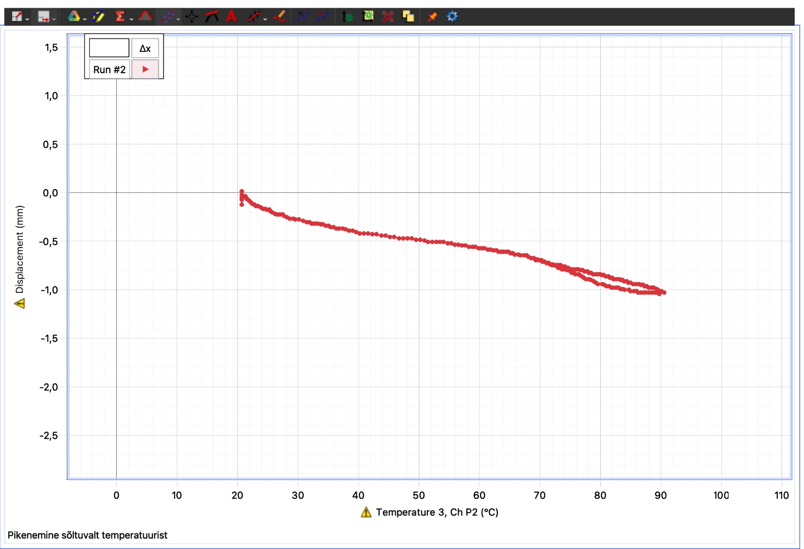
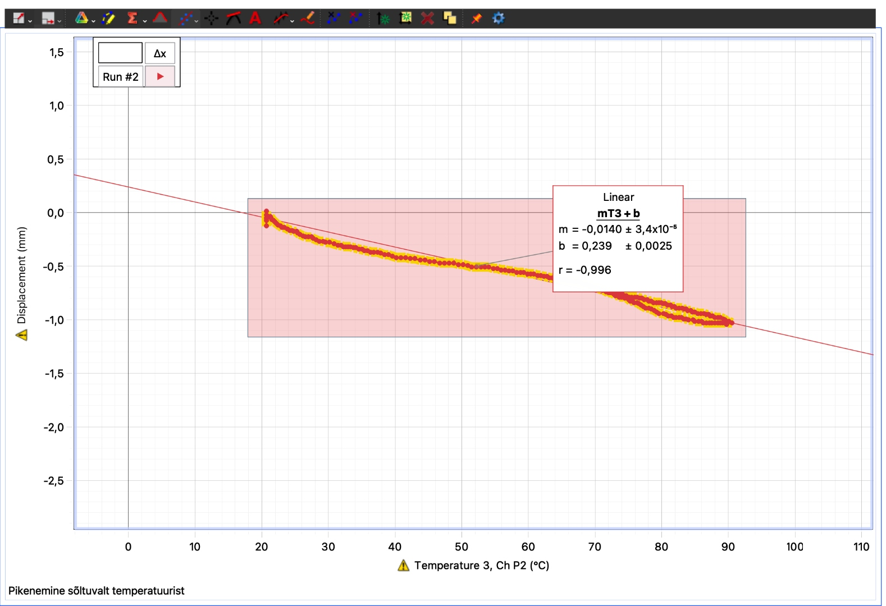

## Theory

When a solid rod is heated, its atoms vibrate more intensely and tend to occupy slightly more space, causing the rod to expand. This phenomenon is known as thermal expansion. For most solids, particularly metals, the change in length is proportional to the initial length and to the temperature change.

The relationship describing linear thermal expansion is:

$$Δl=αlΔT$$

where:

- $Δl$ is the change in length of the rod.
- $\alpha$ is the coefficient of linear expansion.
- $l$ is the initial length of the rod.
- $ΔT$ is the temperature change.

The proportionality constant, $\alpha$, quantifies how much the material expands per degree of temperature increase per unit length. By measuring the change in length as the temperature increases and knowing the initial length, the coefficient of expansion can be determined. The coefficient of expansion is calculated using:

$$\alpha = \frac{Δl}{lΔT}$$

The behavior is linear within moderate temperature ranges, and different metals have different coefficients reflecting their atomic structure and bonding strength. This property is critical in engineering, where thermal expansion can affect material performance and structural integrity.

## Experimental Procedure

The brass tube was measured for its initial length at room temperature, then secured in the PASCO Thermal Expansion Apparatus with sensors for temperature and displacement attached. The steam generator was used to steadily heat the tube while the PASCO interface recorded changes in length and temperature (Figure 1). Data collection continued as the rod was heated to around $90° C$ and then allowed to cool. The resulting displacement versus temperature data was analyzed to determine the thermal expansion coefficient using the linear fit method (Figure 2).

<figure>
  
  <figcaption>Figure 1: Relation between temperature and displacement.</figcaption>
</figure>

<figure>
  
  <figcaption>Fig. 1. My dissertation's emotional support animal.</figcaption>
</figure>

## Measurements and Formula Application

The initial length of the rod was measured as $l = 0.75m$. The linear fit of the displacement versus temperature graph yielded a slope$m = -0.0140mm/°C$ with an uncertainty of $U_m = 3.4×10^{-5} mm/°C$.

### Coefficient of Linear Expansion 

The coefficient of linear expansion was calculated using:

$$\alpha = \frac{m}{l}$$

So, we have:

$$\alpha = \frac{-1.40 × 10^{-5}}{0.75} = -1.87 × 10^{-5}° C^{-1}$$

Since the negative sign arises from the orientation of the measurement axes rather than an actual contraction of the brass rod, the physical coefficient is taken as the magnitude of this value.

$$
α = |m| / l = 1.87 × 10⁻⁵ °C⁻¹
$$

### Coefficient of Uncertainty

The uncertainty was calculated as:
$$U_a = \frac{U_m}{l}$$
Where $u_m$ is converted to meters per degree:
$$U_a = \frac{3.4 × 10^{-8}}{0.75} = 4.5 × 10^{-8}° C^{-1}$$

## Conclusion

The material tested was brass. The linear fit of the displacement–temperature data produced a negative slope due to the orientation of the measurement axes; however, the physical thermal expansion coefficient is taken as the magnitude of this value. The resulting coefficient of linear expansion was

$$
\alpha = 1.87 \times 10^{-5} C^{-1} \pm 4.5 \times 10^{-8} C^{-1}
$$

The accepted value for brass is approximately $1.8 - 2.0 \times 10^{-5} C^{-1}$.
The measured value agrees well with the accepted range, indicating that the experimental procedure and analysis were accurate within the expected limits of uncertainty.
